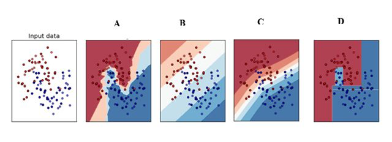

<!-- Sources:
https://www.analyticsvidhya.com/blog/2017/01/must-know-questions-deep-learning/
-->

This quick quiz gauges your current understanding of Deep Learning. Multiple answers are possible. Please answer the questions without searching online for advice or solution.

# Q1
Below is a mathematical representation of a neuron.

The different components of the neuron are denoted as:

* x0, x1,…, xN: These are inputs to the neuron. These can either be the actual observations from input layer or an intermediate value from one of the hidden layers.
* w0, w1,…,wN: The Weight of each input.
* b: Is termed as Bias units. These are constant values added to the input of the activation function corresponding to each weight. It works similar to an intercept term.
* a: Is termed as the activation of the neuron which can be represented as $a=f(\sum_{i=0}^{N}w_{i}x_{i})$
* and y: is the output of the neuron

Considering the above notations, will a line equation (y = mx + c) fall into the category of a neuron?

A. Yes\
B. No\

Solution: (A)\
A single neuron with no non-linearity can be considered as a linear regression function.

# Q2
The difference between deep learning and machine learning algorithms is that there is no need of feature engineering in machine learning algorithms, whereas, it is recommended to do feature engineering first and then apply deep learning.

A. TRUE\
B. FALSE\
C. Cannot decide

Solution: (B)
Deep learning itself does feature engineering whereas machine learning requires manual feature engineering.

# Q3
What are the steps for using a gradient descent algorithm?

1. Calculate error between the actual value and the predicted value
2. Reiterate until you find the best weights of network
3. Pass an input through the network and get values from output layer
4. Initialize random weight and bias
5. Go to each neuron which contributes to the error and change values of its weights to reduce the error.

A. 1, 2, 3, 4, 5\
B. 5, 4, 3, 2, 1\
C. 3, 2, 1, 5, 4\
D. 4, 3, 1, 5, 2\

Solution: (D)\
Option D is correct

# Q4
Which of the following gives non-linearity to a neural network?

A. Stochastic Gradient Descent\
B. Rectified Linear Unit\
C. Convolution function\
D. Linear activation function\

Solution: (B)\
Rectified Linear unit is a non-linear activation function.

#Q5
Which of the following is true about model capacity (where model capacity means the ability of neural network to approximate complex functions)?

A. As number of hidden layers increase, model capacity increases\
B. As dropout ratio increases, model capacity increases\
C. As learning rate increases, model capacity increases\
D. Increasing model capacity helps to reduce overfitting

 Solution: (A)\

#Q6
What is the sequence of the following tasks in a perceptron?

* Initialize weights of perceptron randomly\
* Go to the next batch of dataset\
* If the prediction does not match the output, change the weights\
* For a sample input, compute an output\

A. 1, 2, 3, 4\
B. 4, 3, 2, 1\
C. 3, 1, 2, 4\
D. 1, 4, 3, 2\

 Solution: (D)

# Q7
In a neural network, which of the following techniques is used to deal with overfitting?

A. Dropout\
B. Regularization\
C. Batch Normalization\
D. Early Stopping\

 Solution: (A-D)

#Q8
Which of the following is a decision boundary of Neural Network?

A. B\
B. A\
C. D\
D. C\

Solution: (A-D)\
A neural network is said to be a universal function approximator, so it can theoretically represent any decision boundary.

# Q9
Consider the following scenario. The problem you are trying to solve has a small amount of data. Fortunately, you have a pre-trained neural network that was trained on a similar problem. Which of the following methodologies would you choose to make use of this pre-trained network?

A. Re-train the model for the new dataset\
B. Assess on every layer how the model performs and only select a few of them\
C. Fine tune the last couple of layers only\
D. Freeze all the layers except the last, re-train the last layer\

Solution: (D, maybe C)\
If the dataset is mostly similar, the best method would be to train only the last layer, as previous all layers work as feature extractors.

# Q10
Which of the following is a representation learning algorithm?

A. Deep Feedforward network\
B. Random Forest\
C. k-Nearest neighbor\
D. None of the above

Solution: (A)\
Neural network converts data in such a form that it would be better to solve the desired problem. This is called representation learning.

# Q 11
Backpropagation works by first calculating the gradient of ___ and then propagating it backwards.

A. Sum of squared error with respect to inputs\
B. Sum of squared error with respect to weights\
C. Sum of squared error with respect to outputs\
D. None of the above\

 Solution: (C)

#Q12
My model has overfitted on the training data, what are possible actions to take:

A. Collect more training data\
B. Add dropout\
C. Add fully connected layer to the model\
D. Reduce network size \

 Solution: (A,B,D)

#Q13
Which deep learning frameworks can be used as backend in keras?

A. Torch\
B. Caffe\
C. Tensorflow\
D. Theano\
E. CNTK\
F. Gluon\

 Solution: (C,D)

# Q14
What is the main advantage of using L1 norm for regularizing weigths in ML model?

A. It is easier to compute\
B. It is differentiable everywhere\
C. It brings some weights to 0\
D. It results in models with higher effective capacity\

 Solution: (C)

#Q15
Local minima are serious issue for deep model training.\
*See http://www.deeplearningbook.org/contents/optimization.html*

A. TRUE\
B. FALSE\
C. Cannot decide\

 Solution: (B)

# Q16
With few hyperparameters to tune, what is an reasonable procedure to get their values?

A. Model Based Optimization\
B. Grid Search\
C. Random Search\
D. Manual Tuning\

 Solution (C,D)

# Q17
For all practical purposes, `loss` and `metric` are equivalent in deep model training.

A. TRUE\
B. FALSE\
C. Cannot decide\

 Solution (B)

# Q 18

What is the expected relative size of a parameter update in training?

A. 0.1%\
B. 1%\
C. 10%\
D. 100%

 Solution (A,B)

# Q19
What are the issues with ReLU activation function?

A. It's derivatives are expensive to obtain\
B. It often produces dead neurons\
C. It is common reason for vanishing gradients\
D. It is not differentiable everywhere

 Solution (B,D)

# Q20
What are the issues with Mean Square Loss?

A. It is not differentiable everywhere\
B. It gives too little weight to outliers\
C. It gives too much weight to outliers\
D. It results in biased estimates\
E. It is difficult to interpret\

 Solution (C)

# Q21
What is an appropriate choice of loss for classification task?

A. MSE\
B. Huber loss\
C. Cross Entropy Loss\
D. Hinge Loss\
E. Squared Hinge Loss\

 Solution (C,D,E)
